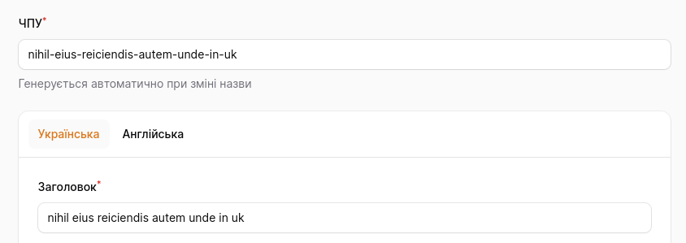
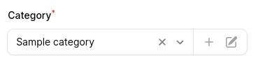
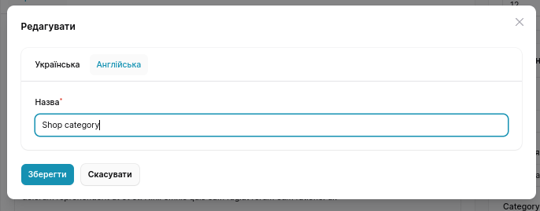

# Filament Astrotomic Translations

[](https://packagist.org/packages/cactus-galaxy/filament-astrotomic)

[//]: # ([![GitHub Tests Action Status]&#40;https://img.shields.io/github/actions/workflow/status/cactus-galaxy/filament-astrotomic/run-tests.yml?branch=main&label=tests&style=flat-square&#41;]&#40;https://github.com/cactus-galaxy/filament-astrotomic/actions?query=workflow%3Arun-tests+branch%3Amain&#41;)

[//]: # ([![GitHub Code Style Action Status]&#40;https://img.shields.io/github/actions/workflow/status/cactus-galaxy/filament-astrotomic/fix-php-code-style-issues.yml?branch=main&label=code%20style&style=flat-square&#41;]&#40;https://github.com/cactus-galaxy/filament-astrotomic/actions?query=workflow%3A"Fix+PHP+code+style+issues"+branch%3Amain&#41;)

[](https://packagist.org/packages/cactus-galaxy/filament-astrotomic)

This package is an extension for [Filament](https://filamentphp.com) and [laravel-translatable](https://docs.astrotomic.info/laravel-translatable).

> Inspired by [spatie/laravel-translatable](https://github.com/filamentphp/spatie-laravel-translatable-plugin), another alternative
> for the translation package for your Laravel application.

> See more configuration examples of the Filament panel in [GalaxyStore](https://github.com/CactusGalaxy/GalaxyStoreExample) - demo project with Filament, Astrotomic package and more.

## Installation

You can install the package via Composer:

```bash
composer require cactus-galaxy/filament-astrotomic
```

If you are running on Laravel 11, you must use another version of the astrotomic package `v11.13`, which is available via fork. 
Add the following lines to your `composer.json` file and repeat composer installation command.

> See more information about that in a pull request - https://github.com/Astrotomic/laravel-translatable/pull/395

```json
{
    "repositories": [
        {
            "type": "vcs",
            "url": "https://github.com/Oleksandr-Moik/laravel-translatable.git"
        }
    ],
}
```

Publish configs for [`astrotomic/laravel-translatable`](https://docs.astrotomic.info/laravel-translatable/installation#configuration) package:

```bash
php artisan vendor:publish --tag="translatable"
```

After this, you will have to configure the locales your app should use.

```php
'locales' => [
    'uk',
    'en',
],
```

## Adding the plugin to a panel

To add a plugin to a panel, you must include it in the configuration file using the `plugins()` method:

```php
use CactusGalaxy\FilamentAstrotomic\FilamentAstrotomicTranslatablePlugin;

public function panel(Panel $panel): Panel
{
    return $panel
        // ...
        ->plugins([
            FilamentAstrotomicTranslatablePlugin::make(),
        ]);
}
```

## Preparing your model class

You need to make your model translatable. You can read how to do this in [documentation for Laravel translatable](https://docs.astrotomic.info/laravel-translatable/installation#models).

## Preparing your resource class

You must apply the `ResourceTranslatable` trait to your resource class:

```php
use CactusGalaxy\FilamentAstrotomic\Resources\Concerns\ResourceTranslatable;
use Filament\Resources\Resource;

class ProductResource extends Resource
{
    use ResourceTranslatable;

    // ...
}
```

## Making resource pages translatable

After [preparing your resource class](#preparing-your-resource-class), you must make each of your resource's pages translatable too.
You can find your resource's pages in the `Pages` directory of each resource folder.
To prepare a page, you must apply the corresponding `{Type}Translatable` trait to it:

```php
use CactusGalaxy\FilamentAstrotomic\Resources\Pages\Record\ListTranslatable;
use Filament\Resources\Pages\ListRecords;

class ListProducts extends ListRecords
{
    use ListTranslatable;

    // ...
}
```

```php
use CactusGalaxy\FilamentAstrotomic\Resources\Pages\Record\CreateTranslatable;
use Filament\Resources\Pages\CreateRecord;

class CreateProduct extends CreateRecord
{
    use CreateTranslatable;

    // ...
}
```

```php
use CactusGalaxy\FilamentAstrotomic\Resources\Pages\Record\EditTranslatable;
use Filament\Resources\Pages\EditRecord;

class EditProduct extends EditRecord
{
    use EditTranslatable;

    // ...
}
```

And if you have a `ViewRecord` page for your resource:

```php
use CactusGalaxy\FilamentAstrotomic\Resources\Pages\Record\ViewTranslatable;
use Filament\Resources\Pages\ViewRecord;

class ViewProduct extends ViewRecord
{
    use ViewTranslatable;

    // ...
}
```

### Setting the translatable locales for a particular resource

By default, the translatable locales loaded using [Astrotomic's Locales helper from method `all()`](https://docs.astrotomic.info/laravel-translatable/package/locales-helper#all)
which returns all locales from the `translatable.locales` configuration.
Alternatively, you can customize the translatable locales for a particular resource by overriding the `getTranslatableLocales()` method in your resource class:

```php
use CactusGalaxy\FilamentAstrotomic\Resources\Concerns\ResourceTranslatable;
use Filament\Resources\Resource;

class ProductResource extends Resource
{
    use ResourceTranslatable;

    // ...

    public static function getTranslatableLocales(): array
    {
        return ['uk', 'en'];
    }
}
```

## Using locale tabs on the form

`TranslatableTabs` extends the default [`Filament\Forms\Components\Tabs`](https://filamentphp.com/docs/3.x/forms/layout/tabs) component and provides a way to create tab schema tabs for each locale.
Within the `localeTabSchema` method, you can define the schema for each tab.

You can use it in your form like this:

```php
use CactusGalaxy\FilamentAstrotomic\Forms\Components\TranslatableTabs;
use CactusGalaxy\FilamentAstrotomic\Resources\Concerns\ResourceTranslatable;
use CactusGalaxy\FilamentAstrotomic\TranslatableTab;
use Filament\Forms\Form;
use Filament\Resources\Resource;

class ProductResource extends Resource
{
    use ResourceTranslatable;

    // ...
   
    public static function form(Form $form): Form
    {
        return $form->columns(1)->schema([
            Forms\Components\TextInput::make('slug')
                ->unique(ignoreRecord: true)
                ->required()
                ->readOnly()
                ->helperText('Генерується автоматично при зміні назви')
                ->maxLength(255),
            
            TranslatableTabs::make()
                ->localeTabSchema(fn (TranslatableTab $tab) => [
                    Forms\Components\TextInput::make($tab->makeName('name'))
                        // required only for the main locale
                        ->required($tab->isMainLocale())
                        ->maxLength(255)
                        // generate slug for the item based on the main locale
                        ->live(onBlur: true)
                        ->afterStateUpdated(function (Forms\Set $set, Forms\Get $get, $state) use ($tab) {
                            if ($tab->isMainLocale()) {
                                $set('slug', Str::slug($state));
                            }
                        }),
                ]),

            // ...
        ]);
    }
    
    // ...
}
```



With this code, you will get tabs for each locale with `name` field in each tab. `name` field will be **required** only for the **main locale**.
Also, it will generate a slug for the item based on the main locale.

By default `$tab->makeName('name')` uses array syntax for naming -`{$locale}.{$name}`, but you can change it by calling `makeNameUsing` on `TranslatableTabs`, for example, use [plain syntax](https://docs.astrotomic.info/laravel-translatable/usage/forms#request-as-plain-syntax):

```php
TranslatableTabs::make()
    // plain syntax
    ->makeNameUsing(fn (string $name, string $locale) => "{$name}:{$locale}")
    // or use an alias
    ->makeNameUsingPlainSyntax()
    // ..
```

## Processing modal forms with translations

If you want to use translations in modal forms, you need to make some changes, to correctly mutate and fill your form.

### Edit table action

For example, we have `ProductResource` but don't have an edit page.

To process translations in the Edit action modal, you need to override the `mutateRecordDataUsing` method of the `EditAction` class in the resource class.

And if you are using a Column with path `translation.*`, make sure to unset the `translation` relation from the record data before returning it, otherwise, the record data will be saved incorrectly.

```php
use App\Models\Product;
use CactusGalaxy\FilamentAstrotomic\Forms\Components\TranslatableTabs;
use CactusGalaxy\FilamentAstrotomic\Resources\Concerns\ResourceTranslatable;
use Filament\Forms\Form;
use Filament\Tables;
use Filament\Tables\Table;


class ProductResource extends Resource
{
    use ResourceTranslatable;

    // ...

    public static function form(Form $form): Form
    {
        // ... form with `TranslatableTabs`
    }

    public static function table(Table $table): Table
    {
        return $table
            ->columns([
                Tables\Columns\TextColumn::make('translation.name'),
                // ...
            ])
            // ...
            ->actions([
                Tables\Actions\EditAction::make()->mutateRecordDataUsing(function (Product $record, array $data) {
                    return self::mutateTranslatableData($record, $data);
                })->mutateFormDataUsing(function (Product $record, array $data) {
                    $record->unsetRelation('translation');

                            return $data;
                }),
                // ...
            ]);
    }

    public static function getPages(): array
    {
        return [
            'index' => Pages\ListProducts::route('/'),
            // edit route is missing 
        ];
    }
```

### Select with modal options

There is a more complex example with `Select` component.
For example, we need to manage (create or edit) a category for the product.

In the `CategoryResource` defined form with translatable fields.

```php
use CactusGalaxy\FilamentAstrotomic\Forms\Components\TranslatableTabs;
use CactusGalaxy\FilamentAstrotomic\Resources\Concerns\ResourceTranslatable;
use CactusGalaxy\FilamentAstrotomic\TranslatableTab;
use Filament\Forms;
use Filament\Forms\Form;


class CategoryResource extends Resource
{
    use ResourceTranslatable;

    // ...

    public static function form(Form $form): Form
    {
        return $form
            ->schema([
                TranslatableTabs::make()
                    ->localeTabSchema(fn (TranslatableTab $tab) => [
                        Forms\Components\TextInput::make($tab->makeName('name'))
                            ->required($tab->isMainLocale())
                            ->maxLength(255),
                    ]),
            ]);
    }

    // ...

}
```

Then is `ProductResource` we can use `Select` component with modal options. Note that we need to call the `fillEditOptionActionFormUsing` method and mutate record data 

```php
use App\Models\Category;
use Filament\Forms;
use Filament\Forms\For;


Forms\Components\Select::make('category_id')
    ->required()
    ->native(false)
    ->searchable()
    ->options(
        Category::query()
            ->joinTranslations()
            ->pluck('name', 'categories.id')
            ->toArray()
    )
    // Configure create action - https://filamentphp.com/docs/3.x/forms/fields/select#creating-a-new-option-in-a-modal
    ->createOptionModalHeading('Create')
    ->createOptionForm(fn (Form $form) => CategoryResource::form($form))
    ->createOptionUsing(function (array $data) {
        $optionRecord = Category::create($data);

        return $optionRecord->id;
    })
    // Configure edit action - https://filamentphp.com/docs/3.x/forms/fields/select#editing-the-selected-option-in-a-modal
    ->editOptionModalHeading('Edit')
    ->editOptionForm(fn (Form $form) => CategoryResource::form($form))
    ->fillEditOptionActionFormUsing(function (string $state) {
        if (!$state) {
            return [];
        }

        $optionRecord = Category::find($state);

        return CategoryResource::mutateTranslatableData($record, $record->attributesToArray());
    })
    ->updateOptionUsing(function (array $data, string $state) {
        $optionRecord = Category::find($state);

        $optionRecord->update($data);

        return $optionRecord->id;
    })
```





## Columns for translatable models on listings

Out of the box, Filament supports nesting for columns, which means you can use `.` in the column path to access nested properties, and you don't need a special column for translatable models.

```php
Tables\Columns\TextColumn::make('translation.name'),
```

**But** searching by translatable column is more complicated to write for each text column. 
To solve and to add an option to search by column, we recommend adding the following lines to configure your column to your **ServiceProvider** in **boot** method.

> From [FilamentServiceProvider](https://github.com/CactusGalaxy/GalaxyStoreExample/blob/main/app/Providers/FilamentServiceProvider.php#L81) of `GalaxyStore` 

```php
use Astrotomic\Translatable\Translatable;
use Astrotomic\Translatable\Contracts\Translatable as TranslatableContract;
use Filament\Tables\Columns\TextColumn;
use Filament\Tables\Table;
use Illuminate\Database\Eloquent\Builder;


// in `boot` method

TextColumn::configureUsing(function (TextColumn $column): void {
    // match `translations.title` or `translation.title`
    if (Str::match('@^translations?\.(\w+)$@', $column->getName())) {
        $column
            ->searchable(query: function (Builder $query, string $search) use ($column): Builder {
                $columnName = Str::after($column->getName(), '.');
                if ($query->hasNamedScope('whereTranslationLike')) {
                    /* @var Translatable|TranslatableContract $query */
                    return $query->whereTranslationLike($columnName, "%{$search}%");
                }

                return $query->where($columnName, 'like', "%{$search}%");
            });
    }
});
```

> Maybe in the feature someone will create a column for that 🙂, but currently you can use this code to configure your columns.

## Testing

```bash
composer test
```

## Changelog

Please see [CHANGELOG](CHANGELOG.md) for more information on what has changed recently.

## Contributing

> Please see [CONTRIBUTING](.github/CONTRIBUTING.md) for details.

As quick example, you can clone [GalaxyStore](https://github.com/CactusGalaxy/GalaxyStoreExample) and this package to one folder

```
Projects
|-FilamentAstrotomic
|-GalaxyStore
```

Add `repositories` section to your `GalaxyStore/composer.json` file

```json
{
    "repositories": [
        {
            "type": "path",
            "url": "../FilamentAstrotomic",
            "options": {
                "symlink": true
            }
        }
    ]
}
```

Then execute composer

```bash
composer require "cactus-galaxy/filament-astrotomic:@dev"
```

or manually add package to `composer.json` file

```json
{
    "require": {
        "cactus-galaxy/filament-astrotomic": "@dev"
    }
}
```

## Security Vulnerabilities

Please review [our security policy](../../security/policy) on how to report security vulnerabilities.

## Credits

- [Oleksandr Moik](https://github.com/oleksandr-moik)
- [All Contributors](../../contributors)

## License

The MIT License (MIT). Please see [License File](LICENSE.md) for more information.
